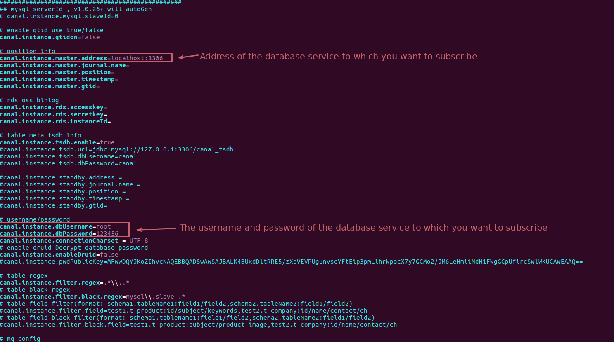

# Canal Data Subscribe Quickstart Guide

This README.md describes how to set up a canal-server and how to use the canal-data-subscribe service


<p align="center">
  <a>
   
  </a>
</p>

## Development Environment  
JDK     &nbsp;&nbsp;&nbsp;&nbsp;&nbsp;&nbsp;&nbsp;&nbsp;&nbsp;&nbsp;&nbsp;&nbsp;&nbsp;&nbsp;&nbsp;&nbsp;&nbsp;&nbsp;&nbsp;1.8.0_202  
Maven   &nbsp;&nbsp;&nbsp;&nbsp;&nbsp;&nbsp;&nbsp;&nbsp;&nbsp;&nbsp;&nbsp;&nbsp;&nbsp;&nbsp;3.5.4  
Spring Boot &nbsp;&nbsp;&nbsp;&nbsp;&nbsp;&nbsp;2.0.3.RELEASE  

## Build Canal Server By Docker
1、Pull the canal server image (now officially 1.1.5)
````
docker pull canal/canal-server
````
2、Obtain the default configuration file of canal. The configuration file of canal is under **/home/admin/canal-server/conf**. We mount the whole directory to facilitate the maintenance of node instances later, The host mount path is **/data/env/canal** as an example.
````
docker run --name canal-server -p 11111:11111 -d  canal/canal-server:v1.1.4 && docker cp  canal-server:/home/admin/canal-server/conf /data/env/canal && cd /data/env/canal
````
3、Modify the configuration file of the default instance
````
vim /data/env/canal/example/instance.properties
````
<p align="left">
  <a>
   
  </a>
</p>

4、Delete the original container, deploy the new container, and mount the data volume
````
docker rm -f canal-server && docker run --name canal -p 11111:11111 -d -v /data/env/canal:/home/admin/canal-server/conf  canal/canal-server
````

## Enable binlog for the database service, add the following configuration in my.cnf and restart the service
````
[mysqld]
lower_case_table_names = 1
log-bin=mysql-bin
binlog-format=ROW
server_id=1
binlog-rows-query-log-events=true
````

## Start the service and invoke the interface to add a subscription. See [API](./canal-data-subscribe-api.yaml) for detailed interface documentation